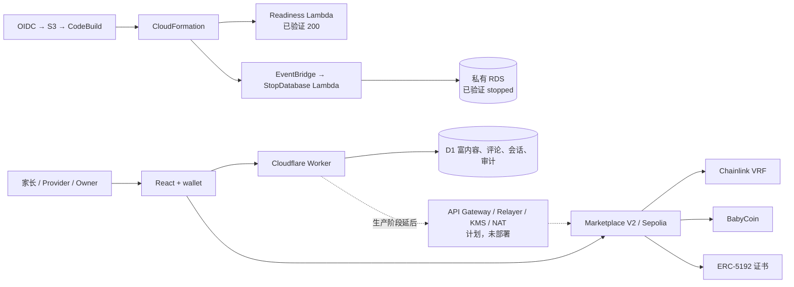
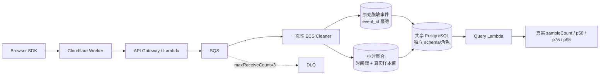

# BabySteps / StarBuddy 架构

完整、可执行的架构真相源见 [`docs/architecture/starbuddy-web3-architecture.mmd`](architecture/starbuddy-web3-architecture.mmd)。当前 StarBuddy 主题业务图见 [`docs/architecture/starbuddy-web3-architecture-v2.png`](architecture/starbuddy-web3-architecture-v2.png)；上一版 PNG 保留为历史证据。

## 当前边界

- 浏览器：React、外部钱包；Privy 邮箱入口仍待接入。
- Cloudflare：Pages 已有历史上线证据；Worker/D1 已完成本地实现，远程待部署。
- Sepolia：V1 BabyCoin、Marketplace 和 VRF 闭环已有交易证据；V2 审核、幂等完成和 ERC-5192 已本地验证，待部署。
- AWS：隔离 VPC、两条私有子网、私有 RDS、Readiness/自动停库 Lambda、EventBridge、GitHub OIDC、私有 S3 与 CodeBuild 已真实部署；Runtime Stack 为 `CREATE_COMPLETE`，RDS 为 `stopped`。API Gateway、NAT/EIP、KMS、Secrets 和生产 Relayer 明确延后。
- 读取：公共 RPC 有历史证据；ethers.js 三源对照与 The Graph 仍待实现。

## 核心数据流

链上保存角色、任务状态、随机价格/时间、支付、完成哈希与证书；D1 保存视频 URL、评论、用户名和审计。当前 RDS 只完成私网、加密和停库基础设施验收，还没有迁移业务表或接收产品数据；未来 Relayer 才会保存完成请求的幂等状态和 webhook nonce hash。三个存储都不得保存儿童敏感信息。

## AWS 启动与清理门禁

AWS 工作流仅允许 `workflow_dispatch`。只有 main、`start_services=true`、GitHub `aws-readiness` Environment 人工审批和 OIDC 短期身份同时满足，才会上传 S3 源码包并启动单并发 CodeBuild。buildspec 在测试、类型和 SAM lint 后再次检查 `ALLOW_AWS_PAUSABLE_DEPLOYMENT=true`，然后只允许部署 `aws/pausable-template.yaml`。

本次已用不可变提交 ZIP 直接启动同一 CodeBuild 项目并完成云端闭环；GitHub main 的 OIDC workflow 端到端触发仍待分支合并/推送后验证。RDS 已自动停止，但仍收存储费；永久删除 CloudFormation Stack 前仍需按精确 Region、Stack 和资源列表再次确认。真实证据见 [`docs/evidence/deployment/2026-08-11-aws-pausable.md`](evidence/deployment/2026-08-11-aws-pausable.md)。

## 性能观测链路（AWS 闭环已验证）

展开版图片见 [`starbuddy-performance-global-architecture.svg`](architecture/starbuddy-performance-global-architecture.svg)，六阶段时序见 [`starbuddy-performance-pipeline-sequence.svg`](architecture/starbuddy-performance-pipeline-sequence.svg)。

浏览器 SDK 只采允许的性能字段，按采样、限流、20 条或 5 秒批量发送，`sendBeacon` 优先、`fetch keepalive` 兜底。Cloudflare Worker 是同源代理和 Token 边界；API Gateway/Lambda 完成 Token、Schema、时间窗和批量校验后逐条进入 SQS。一次性 ECS Fargate Cleaner 在队列清空后退出，做脱敏、route 归一化、二次校验，并在同一条 SQL 中以 UUID 幂等写入原始事件与小时聚合；重复消息不会重复累计。暂时失败最多重试三次后进入 DLQ。

部署只允许手动触发、GitHub Environment 审批与 OIDC 短期身份。项目栈拥有 API、队列、ECR、无 Service 的 ECS Cluster/Task、Lambda、日志和独立数据库 schema；验证后先 `DROP SCHEMA`，再 `delete-stack`。共享 VPC、子网、单 NAT、RDS 引擎、OIDC 和 Artifact Bucket 受保护，不进入项目清理。

最终 Run [`31765573258`](https://github.com/Tiancheng-Xu/babysteps/actions/runs/31765573258) 在 commit `485999c99225a6211d6e967fd72f83cfe0ed6c17` 上完成：受控 `LCP=321` 事件被接收并由 ECS Cleaner 以 `exitCode=0` 清洗，PostgreSQL 回读 `sampleCount=1`、`p50=p75=p95=321`、`errorRate=0`。取证后项目 schema 与精确 Stack 删除，Stack、ECS、ECR、SQS、Lambda、API、日志、Secrets 和 active task definitions 九类盘点均为 0；共享底座未进入清理。
