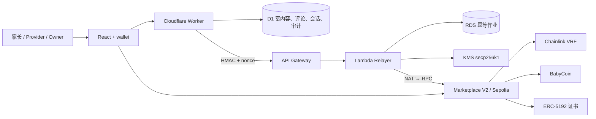

# BabySteps / StarBuddy 架构

完整、可执行的架构真相源见 [`docs/architecture/starbuddy-web3-architecture.mmd`](architecture/starbuddy-web3-architecture.mmd)。当前 StarBuddy 主题业务图见 [`docs/architecture/starbuddy-web3-architecture-v2.png`](architecture/starbuddy-web3-architecture-v2.png)；上一版 PNG 保留为历史证据。

## 当前边界

- 浏览器：React、外部钱包；Privy 邮箱入口仍待接入。
- Cloudflare：Pages 已有历史上线证据；Worker/D1 已完成本地实现，远程待部署。
- Sepolia：V1 BabyCoin、Marketplace 和 VRF 闭环已有交易证据；V2 审核、幂等完成和 ERC-5192 已本地验证，待部署。
- AWS：API Gateway、Lambda、私有 RDS、KMS、VPC/NAT、GitHub OIDC 与 CodeBuild 已通过本地模板、单测和构建；没有创建或修改云资源。
- 读取：公共 RPC 有历史证据；ethers.js 三源对照与 The Graph 仍待实现。

## 核心数据流

链上保存角色、任务状态、随机价格/时间、支付、完成哈希与证书；D1 保存视频 URL、评论、用户名和审计；RDS 只保存完成请求的幂等状态和 webhook nonce hash。三个存储不保存儿童敏感信息。

## AWS 启动与清理门禁

AWS 工作流仅允许 `workflow_dispatch`。只有 main、`start_services=true`、GitHub `aws-readiness` Environment 人工审批和 OIDC 短期身份同时满足，才会上传 S3 源码包并启动单并发 CodeBuild。buildspec 在测试、类型和 SAM lint 后再次检查 `ALLOW_AWS_PAID_DEPLOYMENT=true`，然后才允许 `sam deploy`。

当前该门禁未被打开。未来云端闭环和 Evidence 通过后，触发费用/资源清单与 `aws-homework-cleanup` 检查；可逆停用优先，永久删除 CloudFormation Stack 前仍需按精确 Region、Stack 和资源列表再次确认。
