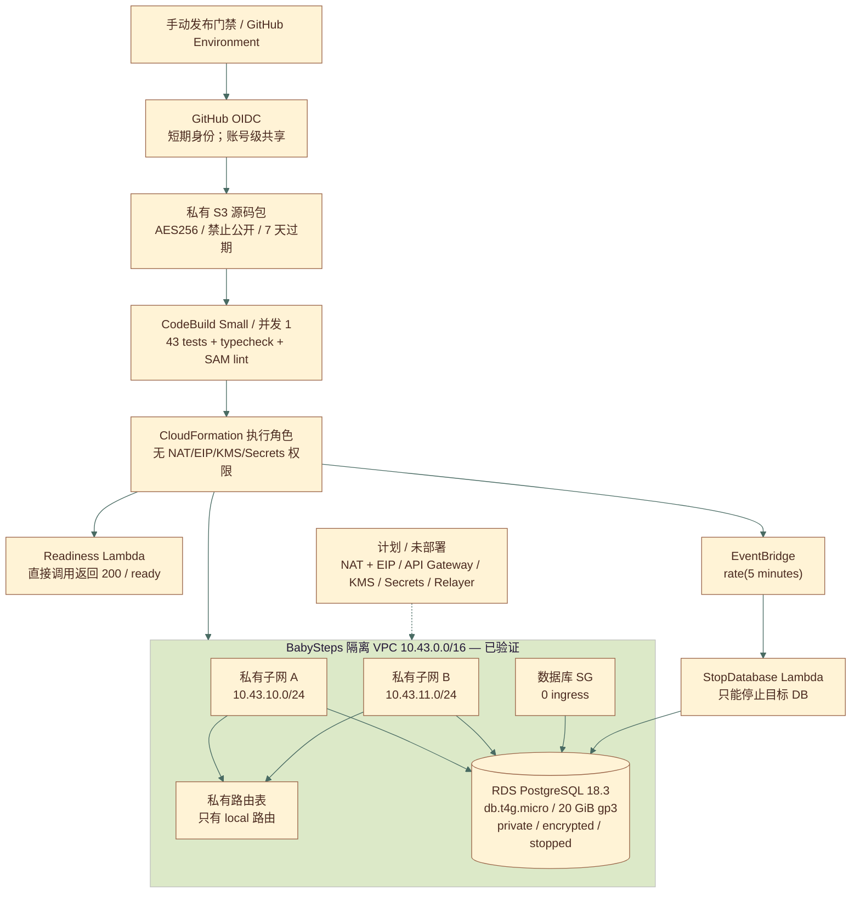

# AWS 可暂停运行时部署 Evidence — 2026-08-11

## 结果

BabySteps 的 AWS 可暂停阶段已在 `us-east-1` 真实部署并通过独立读取验收：CloudFormation Stack 为 `CREATE_COMPLETE`，CodeBuild 为 `SUCCEEDED`，私有 RDS PostgreSQL 已自动进入 `stopped`。本阶段没有创建 NAT Gateway、EIP/公网 IPv4、Internet Gateway、ALB、KMS、Secrets Manager 或生产 Relayer。

- 源码提交：`940f2a490a373e92cdbb2d7b2ca0320de2bd6739`
- Bootstrap Stack：`babysteps-aws-readiness-bootstrap`，`UPDATE_COMPLETE`
- Runtime Stack：`babysteps-homework-readiness`，`CREATE_COMPLETE`
- 成功构建：`babysteps-readiness:fdaf9cbf-7411-454a-9ad6-834bccbb4e84`
- 结构化证据：[`2026-08-11-aws-pausable.json`](2026-08-11-aws-pausable.json)
- 全局架构真相源：[`starbuddy-web3-architecture.mmd`](../../architecture/starbuddy-web3-architecture.mmd)

关键代码位置：VPC `aws/pausable-template.yaml:46`；RDS `:181`；停库角色 `:225`；EventBridge `:297`；Readiness Lambda `:357`；OIDC `aws/bootstrap.yaml:30`；CloudFormation 执行角色 `:129`；CodeBuild `:277`；部署命令 `aws/buildspec.yml:16`；成本门禁 `scripts/validate-aws-readiness.mjs:6`。

## 全局项目架构

```mermaid
flowchart LR
    people["家长 / Provider / Owner"] --> ui["React / StarBuddy UI"]
    ui --> wallet["Privy / 外部钱包<br/>Privy 真实配置待验证"]
    ui --> worker["Cloudflare Worker<br/>V2 发布待验证"]
    worker --> d1[("D1<br/>视频 / 评论 / 用户名 / 审计")]
    ui --> chain["Ethereum Sepolia<br/>BabyCoin + Marketplace + VRF + SBT"]
    ui --> uni["Uniswap v3<br/>BABY 池待注资"]
    chain --> graph["The Graph<br/>本地 build/test；Studio 待部署"]
    chain --> rpc["ethers 三 RPC<br/>公共 RPC 已验证"]
    main["Git main / manual gate"] --> cf["Cloudflare Pages / Worker"]
    main --> awsci["OIDC → S3 → CodeBuild → CloudFormation"]
    awsci --> aws["隔离 VPC / RDS stopped / Lambda / EventBridge<br/>已实现并验证"]
    worker -.-> relayer["API / NAT / KMS / Secrets / Relayer<br/>计划，未部署"]
    relayer -.-> chain
    pr["Feature / PR"] --> preview["Pages branch preview<br/>创建可用；关闭后清理周期待验证"]
```

链上保存角色、任务状态、随机价格/时间、支付、完成哈希和证书；D1 保存产品富内容与身份审计。当前 AWS RDS 只完成私网、加密、停库和运维闭环，没有业务表或产品流量。虚线部分是计划或降级路径，不是已完成证据。

## AWS 架构与数据流



大白话走读：构建只接受不可变提交 ZIP；测试和预算门禁通过后，CloudFormation 才能创建隔离网络和数据库。数据库没有入站规则，也没有公网路由。EventBridge 每五分钟调用一次停库函数；该函数先读取目标数据库状态，只在 `available` 时请求停止，因此也能处理 AWS 最长停止七天后的自动重启。

图例：实线表示本阶段真实调用或依赖；虚线表示明确未部署的后续范围；带 `已验证` 或真实状态的节点才是本次工作证明。

## 验证矩阵

| 要求 | 实现 | 真实验证 | 状态 |
| --- | --- | --- | --- |
| 低成本 CI 引导 | OIDC、私有 S3、CodeBuild Small/并发 1 | OIDC Provider 存在；S3 AES256、四项 Public Access Block、7 天生命周期；Bootstrap `UPDATE_COMPLETE` | 已实现并验证 |
| 私有网络 | 独立 VPC、两 AZ 私有子网、私有路由表 | `vpc-0d3dbeb2bb5f7ff83`；两个子网 `MapPublicIpOnLaunch=false`；路由仅 `10.43.0.0/16 local` | 已实现并验证 |
| 无持续公网资源 | 不创建 IGW、NAT、EIP、ALB | VPC 的 IGW 与 NAT 查询均返回空数组 | 已实现并验证 |
| 私有 PostgreSQL | Single-AZ、加密、20 GiB gp3、无公网、无备份 | `babysteps-homework-readiness-postgres`；PostgreSQL 18.3；`stopped` | 已实现并验证 |
| 自动停库 | EventBridge `rate(5 minutes)` → StopDatabase Lambda | Rule `ENABLED`；唯一 Target 为停库函数；函数读取返回 `stopped` | 已实现并验证 |
| 最小停库权限 | Lambda 仅 Describe RDS 与 Stop 指定 DB | inline policy 的 `StopDBInstance` Resource 为目标 DB ARN | 已实现并验证 |
| Readiness | 128 MiB Node.js Lambda，直接调用 | `StatusCode=200`，body 为 `ready / pausable / relayer deferred` | 已实现并验证 |
| 日志生命周期 | 两个 Lambda Log Group | Retention 3 天 | 已实现并验证 |
| GitHub Actions OIDC 触发 | `workflow_dispatch` + Environment + OIDC | 云端 OIDC/角色已创建；本次构建由已授权 AWS 会话直接启动，尚未从 main 执行 workflow | 已实现但端到端待验证 |
| 生产 Relayer | NAT/EIP、API、KMS、Secrets、RDS 业务表 | 当前执行角色与 buildspec 均拒绝 | 计划 / 需再次确认 |

## 代表性失败与恢复

这些是项目部署边界问题，保留为可靠性证据；本机登录与工具过程不属于 Evidence。

1. `695e4929…`：SAM Transform 的 changeset 权限缺失。补充仅指向官方 Serverless Transform ARN 的 `CreateChangeSet` 后，下一轮越过该阶段。
2. `675c519d…`：SAM 自动角色名被截断，未匹配 IAM 前缀，回滚也需要托管策略解绑。改为固定名称、inline policy 的两个角色，后续角色创建与回滚均成功。
3. `7d23587d…`、`e90df898…`：额外 HTTP readiness API 连续引入标签端点权限。架构复核后删除这项非作业硬需求，改用直接 Lambda invoke；最终构建成功且执行角色完全不含 `apigateway:*`。

每次失败均由 CloudFormation 回滚；进入下一次构建前确认旧 Stack 不存在或所有资源为 `DELETE_COMPLETE`，没有叠加重复 RDS/VPC。

## 复用、费用、配额与清理

| 资源 | 决策 | 增量费用/配额 | 清理责任 |
| --- | --- | --- | --- |
| GitHub OIDC Provider | 账号级共享并保护，不随项目清理 | 无按小时费用；占 1 个 Provider | 全局共享目录维护 |
| 私有制品桶 | Bootstrap 复用；禁止公开；对象 7 天过期 | 少量 S3 存储/请求 | Bootstrap Stack；不要由 runtime 清理 |
| CodeBuild Small | 单项目、并发 1 | 本次约 9 分钟构建及失败构建用量 | Bootstrap Stack |
| 独立 VPC/子网/路由/SG | 不复用默认 VPC，保证项目可独立删除 | 本身无按小时计算费；占网络配额 | Runtime Stack |
| RDS `db.t4g.micro` | 无可复用实例；创建后自动停止 | 停止后不收实例计算费，仍收 20 GiB 存储及可能的备份/IO 费用 | Runtime Stack；复盘后删除需再次确认 |
| Lambda/EventBridge/Logs | 按调用；日志 3 天 | 无空闲实例费；按请求/日志计费 | Runtime Stack |

自动停库不是零费用，也不是销毁。RDS 最长停止七天后 AWS 会自动启动；五分钟规则会再次请求停止。`ExpiresAt=2026-08-13T05:30:00Z` 是清理标记，不会自动删除 Stack。

## 安全与限制

- 数据库 endpoint 和密码没有写入 Evidence；密码只在 CodeBuild 运行时生成，并以 CloudFormation `NoEcho` 参数传递。
- 数据库 SG 的 ingress 为 0。EC2 对 `SecurityGroupEgress: []` 仍保留默认 `0.0.0.0/0` 出站规则；由于 VPC 没有 IGW、NAT、Endpoint、Peering 或非 local 路由，当前仍无实际公网出口。后续若新增网络连接，必须先收紧该规则。
- Readiness Lambda 是直接运维验证，不是公开 API。生产入口、鉴权、告警、业务表迁移与链上 Relayer 都没有在本阶段部署。
- GitHub OIDC 信任条件限定到 `Tiancheng-Xu/babysteps` 的 `aws-readiness` Environment，但 main 上的 Actions 端到端触发尚待分支合并/推送后验证。

## 复现

```bash
pnpm --filter @babysteps/aws test
pnpm --filter @babysteps/aws typecheck
node scripts/validate-aws-readiness.mjs
sam validate --lint --template-file aws/bootstrap.yaml
sam validate --lint --template-file aws/pausable-template.yaml
```

云端复现还必须先通过 `aws-budget-guard`、明确目标账号/Region/费用边界，并使用手动批准的 `aws-readiness` 工作流；不要直接部署 `aws/template.yaml` 中的持续计费参考架构。
