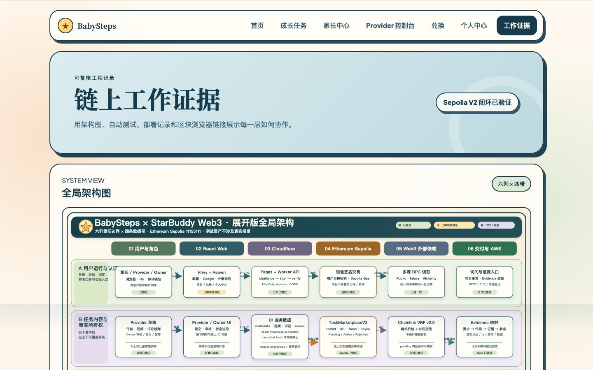
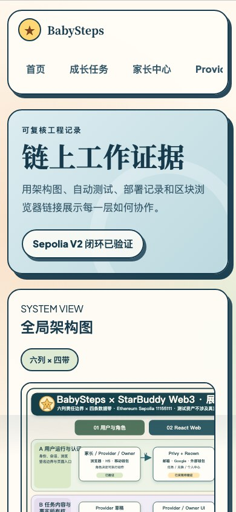

# 架构图片与 Evidence Gate 验收

日期：2026-08-13

## 目标与实现映射

| 作业要求 | 实现功能 | 代码位置 | 验证证据 | 当前状态 |
| --- | --- | --- | --- | --- |
| 交付可放大的完整架构图 | 生成 2400 × 1500 的 StarBuddy 主题 SVG，以六列责任边界和四条数据带覆盖用户请求、Cloudflare/D1、Sepolia、外部 RPC/索引、CI/CD、AWS、安全与清理边界 | `docs/architecture/starbuddy-web3-global-architecture.svg` | SVG 可解析；28,157 字节；五类线型与浅色图例经渲染复核；桌面与手机截图均来自同一份本地生产构建 | 已实现并验证 |
| 交付关键业务时序图 | 生成 2400 × 1800 的 SVG，按登录、获币、上架审核、购买结算、完课证书五阶段串联主线，并在阶段旁标出有界失败路径 | `docs/architecture/starbuddy-web3-business-sequence.svg` | SVG 可解析；20,066 字节；真实方向包含 Worker verify、approve/reject、VRF 请求/回调、Relayer → Marketplace → SBT；失败路径覆盖签名过期、滑点/余额不足、哈希冲突、VRF pending、allowance/receipt 失败、Relayer 重试、Graph 延迟与 RPC 不一致 | 已实现并验证 |
| Evidence 页面友好展示图片 | 两张独立图卡带准确替代文本、图注、“看哪里 / 证明什么”和原图链接；窄屏仅图片容器内部可横向查看 | `web/src/pages/EvidencePage.tsx:30`、`web/src/styles.css:1666` | `web/src/App.test.tsx:409`；390 px 根页面无横向溢出；1440 px 图片完整展开 | 已实现并验证 |
| 本地 Gate 阻止缺图、简图或假图 | Gate 同时检查架构必备章节、状态标记、flowchart/sequenceDiagram、Evidence 页面走读、SVG 最小画布和展开版关键节点 | `scripts/validate-delivery-evidence.mjs:13`、`scripts/validate-delivery-evidence.test.mjs` | TDD RED 先拦住旧简图；实现后专项 12/12 通过；`pnpm validate:delivery-evidence` 通过 | 已实现并验证 |
| GitHub Gate 采用相同规则 | 复用组织级验证工作流，并把本地 Evidence 校验命令作为远端必跑输入 | `.github/workflows/verify-baby2b-project.yml:18`、`.github/workflows/verify-baby2b-project.yml:28` | 工作流静态契约与本地命令一致；本轮未推送，因此远端新提交仍待运行 | 已实现，远端待验证 |

## 图片资产清单

| 文件 | 尺寸 | 字节数 | SHA-256 |
| --- | --- | ---: | --- |
| `starbuddy-web3-global-architecture.svg` | 2400 × 1500 | 28,157 | `bc4302732e93eaae7a53c16951d05f91df34fdf70ae5df7213d2a9f5964259c7` |
| `starbuddy-web3-business-sequence.svg` | 2400 × 1800 | 20,066 | `86cdb4ad0ea466f20a3241d8298c5581ad6e43ec5973936421eda9d573936a80` |
| `evidence-architecture-desktop-1440.jpg` | 1440 × 900 | 182,651 | `72a9ecdfa23bc0d950ce80b0a757b4c657ce79f409c548d9f6bc03901e4db750` |
| `evidence-architecture-mobile-390.jpg` | 390 × 844 | 65,954 | `79fbb7c7474c014d8294c23da121acd3a7650462c116daebf359551ca1bac3ce` |

## 看哪里，证明什么

### 1440 px 桌面 Evidence

- 看哪里：Evidence 标题、六列 × 四带标记，以及新版全局图的标题、责任列与前两条数据带均出现在同一桌面视口；原图链接可继续放大查看全图。
- 证明什么：截图来自真实点击“工作证据”后的生产构建；1440 px 下根页面与两张图框均无横向溢出。

### 390 px 手机 Evidence

- 看哪里：卡片宽度贴合手机，图标题、状态标记和左侧数据带保持可读；需要查看右侧节点时只滚动图片框。
- 证明什么：根页面 `scrollWidth === clientWidth === 390`，图片细节没有被强行压成不可读的小字，也不会造成整站横向溢出。

## 参考项目取长补短

参考公开项目 `yue3694/x-web3` 的结构化表达方式：把全局边界和业务时序分开、用责任列与阶段带承载更多工程信息、明确环境 RPC、清楚标出外部依赖职责。BabySteps 保留自己的真实差异：Cloudflare Worker/D1、Chainlink VRF 随机任务、Uniswap v3、The Graph、三源 RPC 读回和 ERC-5192 SBT。

明确没有照搬 Foundry、固定 Sale 合约、EC2 单机 PostgreSQL/Redis 或对方的图片与部署拓扑。BabySteps 的图只展示仓库中真实存在的实现；AWS Relayer 等尚未云端验证的内容继续标为计划或待验证。

## 验证记录与限制

- 前端回归：28 个测试文件、164 项测试通过。
- 前端生产构建：通过，并把两张 SVG 作为带内容哈希的静态资产打包。
- 绘图前全项目基线：`pnpm check`、381 项测试、`pnpm typecheck`、生产构建、公开产物验证、中央仓库策略与 `git diff --check` 均通过；确认项目处于绿色基线后才开始替换 SVG。
- 绘图后全项目回归：验证器 37 + AWS 43 + Solidity 87 + Web 164 + Worker 48 + Subgraph 4，共 383 项通过；`pnpm check`、`pnpm typecheck`、生产构建和公开产物验证再次通过。
- Evidence 专项 Gate：12/12 通过；同时验证真实文件、最小画布、展开版职责/阶段、五类线型、真实调用方向和失败路径。
- 响应式实测：1440 px 根宽 `1440 / 1440`，两图框 `1136 / 1136`；390 px 根宽 `390 / 390`，两图框 `318 / 840`，横向查看被限制在图框内部。
- 本轮只完成本地实现与证据，没有执行生产部署，也没有把 GitHub 远端运行写成已完成。
- 非阻塞限制：Privy 依赖仍有大分包警告；AWS KMS Relayer 云端闭环和可选 IPFS pin 仍按实际状态标注。
