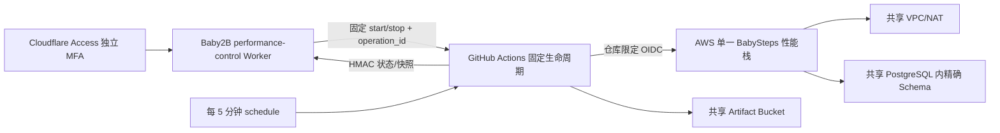
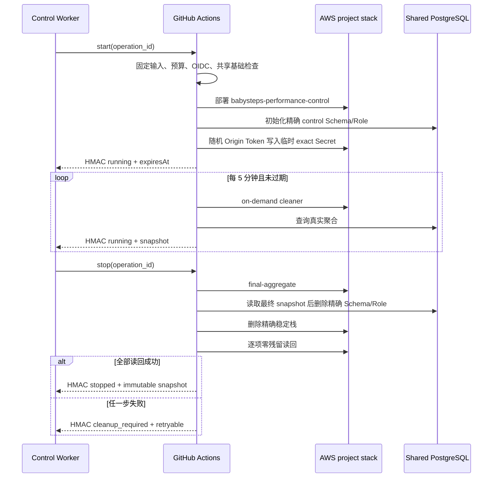

# BabySteps 固定性能生命周期 Evidence

日期：2026-08-26

## 状态口径

| 能力 | 状态 | 证据边界 |
| --- | --- | --- |
| 固定 `start` / `stop` 与定时 expiry 合同 | implemented | 本地工作流与合同测试已实现 |
| 单一稳定栈、`us-east-1`、45 分钟 TTL | implemented | 名称、区域和 TTL 均为工作流常量，不接受调用方 AWS 参数 |
| 共享 VPC、NAT、RDS、Artifact、OIDC 复用 | implemented | 继续消费现有 GitHub Environment 变量和 `aws/performance-template.yaml` 参数，不创建第二套共享基础设施 |
| 周期聚合、最终聚合、快照回调 | implemented | 五分钟 schedule 对未过期栈聚合；stop/expiry 在清理前生成最终快照 |
| HMAC 固定 URL 回调 | implemented | URL 固定为 `https://baby2b.online/api/performance/control/callback`；HMAC 密钥仅来自 GitHub Environment Secret；正文不含 AWS/GitHub 凭据 |
| 临时 Origin Token 生命周期 | implemented | start 内随机生成并 mask；跨 workflow 仅通过临时栈 exact Secrets Manager Secret ARN 回读，随栈删除 |
| AWS Role Secret 读取权限 | pending-cloud-readback | 工作流要求并实际调用 `secretsmanager:DescribeSecret` 与 `secretsmanager:GetSecretValue`；本地测试不伪造 IAM 允许结论 |
| 周期聚合失败状态 | implemented | 聚合失败发送 `degraded`、`retryable=true`，不静默且不误报 `cleanup_required` |
| Shell 输入隔离 | implemented | GitHub event/input 只进入 step-level env；shell 仅引用双引号变量，`operation_id` 在任何 Secret/AWS 步骤前按固定正则验证 |
| 清理失败独立性 | implemented | final aggregate 为 best-effort；Schema 与 Stack 各自独立三次重试，expiry 即使 Schema 未确认删除也继续删栈停止增量费用 |
| 无栈 stop 幂等恢复 | implemented | 只读固定资源名完成零残留读回，成功后发送不含新 snapshot 的 idempotent `stopped` |
| 精确 Schema/Stack 清理与零残留读回 | implemented | 只有 Schema 清理、Stack 删除和逐项读回均成功后才发送 `stopped` |
| 本地合同测试 | verified | 仅表示静态合同通过，不表示 GitHub 或 AWS 实际执行成功 |
| GitHub Environment 审批、OIDC、回调联调 | pending | 本次禁止登录、部署或调用 AWS |
| 真实 45 分钟运行成本和生产零残留 | pending | 必须在明确授权的云端运行后补充脱敏证据 |

## 架构

项目栈只拥有短期 SQS、ECR、ECS Cluster/Task Definition、Lambda、HTTP API、日志、Secret 和运行安全组。共享 VPC、NAT、RDS、Artifact Bucket 与 GitHub OIDC Provider 不属于项目清理范围。

## 时序

定时任务发现 `ExpiresAt` 已到期时执行与 stop 相同的最终聚合和清理路径；没有栈时为无副作用 `noop`。

## 增量成本上限

| 项目 | 45 分钟保守估算（USD） | 说明 |
| --- | ---: | --- |
| Fargate 初始化、周期聚合、最终聚合、清理 | 0.02 | 0.25 vCPU / 0.5 GB 的短任务，按多次运行留余量 |
| Lambda、API Gateway、SQS、CloudWatch Logs | 0.01 | 小流量观察窗口 |
| ECR、Secrets Manager、S3 请求与存储 | 0.01 | 45 分钟短期资源和小型制品 |
| 共享 NAT 数据处理增量 | 0.01 | 不新增 NAT 小时费，仅保守计入少量流量 |
| 不确定性与失败重试预留 | 0.12 | 覆盖镜像拉取、ENI 延迟和一次有限重试 |
| **工作流估算值** | **0.17** | 小于硬门禁 **0.20** |

这是部署前保守估算，不是 AWS Billing 实测。共享 NAT/RDS 的既有基础成本不伪装成该 45 分钟运行的新增成本；任何估算值超过 `USD 0.20` 时工作流在部署前失败。

## 安全与失败限制

- 调用方只能选择 `start` 或 `stop` 并提供幂等 `operation_id`；不能传 Region、Stack、TTL、模板、AWS 参数或回调 URL。
- `schedule` 只解析固定栈的 `ExpiresAt`，未过期时做一次有界聚合，到期时进入 expiry。
- 回调签名为 HMAC-SHA256，严格覆盖 `timestamp + raw JSON body`，并发送 timestamp/signature；URL 固定为 `https://baby2b.online/api/performance/control/callback`，HMAC Secret 被 GitHub Mask，Evidence 只保存脱敏正文。Worker 侧负责时间窗和签名防重放校验。
- Origin Token 不配置为长期 GitHub Secret。start 使用 `openssl rand -hex 32` 生成并立即 mask，CloudFormation 将其保存到 `babysteps-performance-origin-control`；stop/schedule 只能先从固定栈 Output 得到该 exact Secret ARN，再读取 Secret 值。
- `AWS_PERFORMANCE_ROLE_ARN` 对 exact Origin Secret 的 `DescribeSecret` / `GetSecretValue` 能力只有真实 AWS 调用成功后才能记为 `verified-cloud-readback`；当前公开 Evidence 保持 `pending-cloud-readback`。
- 周期聚合失败发送 `degraded` 和 `retryable=true`，表示栈仍在但当前快照不可用；它不会静默，也不会错误声明需要执行资源清理。
- final aggregate 失败不会阻止清理。Schema 清理和固定 Stack 删除分别最多重试三次；expiry 达到 TTL 后，即使 Schema 状态为 residue/unknown，也必须删除临时 Stack 以停止增量费用，并回调 `cleanup_required`，不得发送 `stopped`。
- 如果临时 Stack 已删除但 Schema 仍为 residue/unknown，固定恢复路径必须重建同名临时 admin task、仅执行 `cleanup-schema`、再次删除固定 Stack 并做零残留读回。现有云端 IAM 与该恢复执行仍是 `pending-cloud-readback`；在真实恢复成功前不得把 Schema 标为已删除。
- stop 遇到固定 Stack 已不存在时不会读取调用方提供的 Stack，也不会生成新 snapshot；它只对固定项目资源做零残留读回，用于“资源已清理但 stopped 回调失败”的幂等重试。
- `stopped` 只能在 Schema 删除成功、CloudFormation Stack 不存在以及 ECS/ECR/SQS/Lambda/API/Logs/Secret/Task Definition 精确读回为零后发送。
- 最终聚合或任一清理/读回失败时保留可重试状态并发送 `cleanup_required`，绝不把跳过、超时或未知状态写成清理成功。
- 本实现不证明 Cloudflare Access 策略、GitHub Environment 变量、AWS IAM 权限、真实聚合数据或生产回调已经联通；这些均保持 `pending`。
## Repair round 4: fail-closed cleanup state

- `implemented`: AWS existence reads use `scripts/aws-performance-control-state.sh`. Only service-specific not-found errors, including CloudFormation `ValidationError` containing `does not exist`, produce `absent`; authorization, throttling, network, and unknown errors retry and fail closed.
- `implemented`: the control workflow owns the fixed SSM Standard parameter `/babysteps/performance-control/cleanup-state`. Start writes `running`; incomplete or unknown cleanup writes `cleanup_required`; only schema deletion, stack deletion, and every zero-residue readback write `cleanup_verified`.
- `implemented`: the marker is intentionally outside the temporary CloudFormation stack and survives stack deletion. Its cleanup owner is `babysteps-performance-control`. A Standard parameter has no hourly resource fee; normal SSM API limits and request pricing remain applicable.
- `implemented`: idempotent stop reads the marker. It emits `stopped` only for `cleanup_verified`; missing, malformed, `running`, or `cleanup_required` state emits retryable `cleanup_required` and never upgrades unknown cleanup to success.
- `implemented`: zero-residue verification scans API Gateway resources with fixed `Project=babysteps-performance` and `Environment=control` tags through Resource Groups Tagging API. A command error fails the workflow instead of producing an empty result.
- `verified-local`: lifecycle/error-classification contract tests cover AccessDenied retry/failure, schema-unknown idempotent stop, and orphan API detection. SAM lint is recorded separately below.
- `pending-cloud-readback`: the GitHub AWS role must be verified to allow exact fixed-scope reads and marker updates, including `ssm:GetParameter`, `ssm:PutParameter`, and `tag:GetResources`. No AWS login or cloud operation was performed for this repair.
