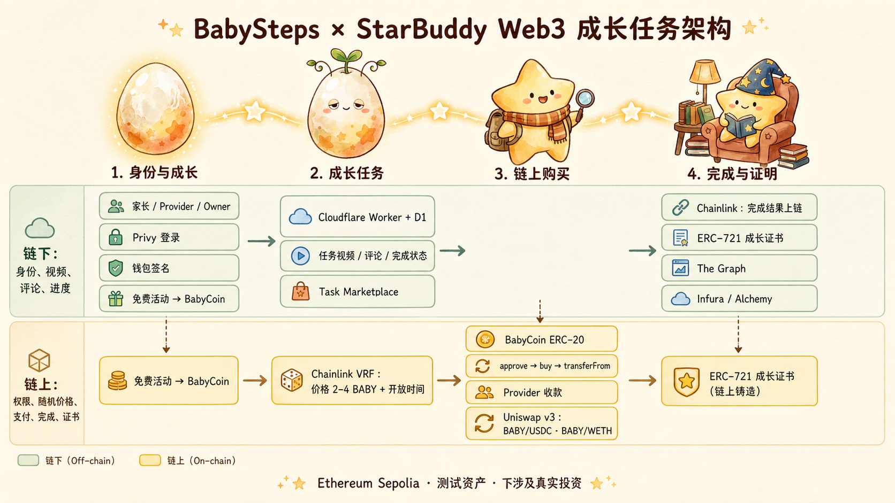

# BabySteps Web3 Growth Marketplace Design

**Status:** Approved on 2026-08-09
**Base repository:** `/Users/shier/Desktop/babysteps`
**Target network:** Ethereum Sepolia
**Stitch project:** https://stitch.withgoogle.com/projects/10462394847748948069

## Product outcome

Extend the existing BabySteps proof of concept into a testnet growth-task marketplace. Keep the current StarBuddy identity, notebook history, and three caregiving activities. Replace the internal transferable star balance in the new deployment with ERC-20 BabyCoin, let authorized providers publish growth tasks, use Chainlink VRF to lock a random task price and availability window, accept BabyCoin through `approve -> buy -> transferFrom`, confirm completion from an off-chain service through a currently supported Chainlink oracle path, and mint an ERC-721 growth certificate.

The existing Sepolia `OnchainNotebook` deployment remains read-only evidence. No legacy balance or activity state migrates into the new contracts.

## Users and authority

- **Parent:** signs in through Privy, proves wallet ownership, earns or acquires BabyCoin, purchases a task, comments after purchase, and receives a certificate.
- **Provider:** an institution or childcare professional whose wallet has `PROVIDER_ROLE`; creates tasks and confirms completion off chain.
- **Owner:** grants and revokes provider access, pauses tasks, manages test token distribution, and configures oracle consumers.
- **Oracle workflow:** transports an approved off-chain completion result to the marketplace contract. It does not decide whether the underlying real-world work is truthful.

## Chain boundaries

### On chain

- BabyCoin ERC-20 balance, allowance, transfers, and lifetime earned total
- provider authority
- task ID, provider, payee, activity type, metadata URI/hash, VRF request, price, availability window, and state
- purchase, completion, and certificate ownership
- auditable events for The Graph and evidence pages

### Off chain

- Privy identity and challenge-sign-verify session
- task title, description, cover URL, video URL, completion instructions, and comments
- provider display name
- completion decision and audit record

No child account, likeness, name, birth date, school, location, health, vaccine, feeding, or sleep data is collected.

## Contract units

1. **BabyCoin** owns ERC-20 behavior and `lifetimeEarned`. Reward minting increases both balance and lifetime earned; test/liquidity minting changes balance only.
2. **GrowthActivities** owns Meal, Walk, and Read cooldowns, UTC+8 daily caps, and reward issuance.
3. **TaskMarketplace** owns provider access, task creation, VRF lifecycle, purchases, pauses, and completion confirmation.
4. **GrowthCertificate** owns transferable ERC-721 certificates and prevents more than one certificate per purchase.

The existing `OnchainNotebook` is not modified to become an ERC-20 or marketplace.

## Growth rules

| Activity | Reward | Cooldown | UTC+8 daily cap |
|---|---:|---:|---:|
| Meal | 3 BABY | 3-4 hours | 6 |
| Walk | 5 BABY | 8-12 hours | 2 |
| Read | 7 BABY | 4-6 hours | 3 |

Growth stage reads `lifetimeEarned`: Egg `<3`, Sprout `3-7`, Explorer `8-14`, Star `>=15`. Transfers, Uniswap swaps, test allocations, purchases, and provider receipts do not increase lifetime earned. Spending never reduces a stage.

## Task and VRF lifecycle

`Draft -> PendingRandomness -> Active -> Expired`, with Owner-controlled `Paused` and observable `RandomnessFailed` states.

Creating a task requests two VRF words. The first sets `price = (2 + word0 % 3) BABY`. The second chooses an integer availability duration: Meal 3-4 hours, Walk 8-12 hours, Read 4-6 hours. A task cannot be purchased before fulfillment. A provider cannot cancel or reroll an unfavorable result. The result is locked for every parent.

## Purchase and completion

Each wallet can purchase a task once. The UI reads the locked price, obtains an exact allowance, then calls `buy(taskId)`. The marketplace takes the buyer from `msg.sender`, transfers the exact price to the provider payee, stores the historical price, and emits an event.

The provider marks a purchase completed in the Cloudflare Worker/D1 service. A currently supported Chainlink oracle workflow carries that result to the marketplace. Legacy Chainlink Functions is not a dependency. The marketplace verifies oracle authority, marks the purchase complete once, and mints one ERC-721 certificate.

## Supporting systems

- **Privy + challenge-sign-verify:** adult login and wallet ownership proof; nonce is single-use and expires.
- **Cloudflare Worker + D1:** minimum task metadata, video URL, comment, profile, completion, and audit APIs.
- **The Graph:** indexes provider, task, randomness, purchase, completion, and certificate events.
- **Infura + Alchemy:** independent ethers.js reads used for redundancy and homework evidence.
- **Uniswap v3 Sepolia:** `BABY/USDC` and `BABY/WETH` test pools. The application links to the official interface instead of implementing a custom router.

## UI source of truth

Use the Stitch project’s Chinese canonical screens and its `Celestial Nursery` design system. Prioritize:

- desktop/mobile home
- desktop/mobile growth marketplace
- desktop/mobile parent dashboard
- desktop provider console
- desktop evidence page
- wrong-network and transaction-pending states

Ignore duplicate English variants and historical notebook-only modal variants unless a preserved legacy notebook flow still needs them. Maintain the warm picture-book theme, 18px minimum body copy, large touch targets, cream paper surfaces, deep blue-green outlines, apricot CTAs, sage success states, and muted purple Web3 states.

## Security and non-goals

- Sepolia and test assets only; no real value or investment promise.
- Never request or store a private key or seed phrase.
- Use OpenZeppelin token, access-control, reentrancy, and safe-transfer primitives.
- Map every VRF request ID to exactly one task and never allow rerolls.
- Make completion and certificate callbacks idempotent.
- Do not add KYC, video upload, NFT marketplace, DAO arbitration, leverage, lending, cross-chain bridges, or Cosmos to this feature.

## Acceptance boundary

The feature is complete when a provider can create a task, VRF activates it with a 2-4 BABY price and valid duration, a parent can earn or acquire BABY and purchase once, the off-chain service can record completion, the supported oracle workflow can confirm completion on chain, one certificate is minted, and The Graph plus both RPC providers can independently show the evidence. Sepolia deployment and external pools happen only after local and test-environment gates pass.
