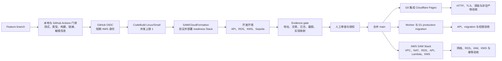
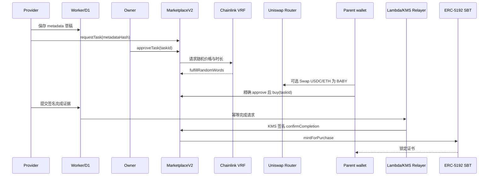

# 补全 BabySteps Web3 作业要求

本设计在现有 BabySteps 项目上补齐 Web3 大学作业。最终交付必须展示链上与链下数据绑定、Owner 审核、BabyCoin 支付、Uniswap v3 兑换、Privy 登录、自动发证、RPC 读取和 The Graph 索引。旧 Sepolia 部署继续作为历史证据，新功能通过 V2 合约和独立开发环境实现。

## 目标与作业边界

本项目把课程平台改写为 BabySteps 成长任务市场。学习机构或育婴师上架成长任务，家长使用 BabyCoin 购买，完成任务后获得不可转让的成长证书。

本期覆盖以下作业要求：

1. 链上任务事实与链下视频、评论、资料通过稳定 ID 绑定
2. Owner 管理机构和育婴师权限，Provider 提交任务，Owner 审核上架
3. 使用 ERC-20 BabyCoin 代替课程示例中的 YD 币
4. 建立 BABY/USDC 与 BABY/WETH Uniswap v3 测试池，并提供站内 Swap
5. 展示余额检查、Swap、精确额度 Approve、Buy、确认和失败状态
6. 任务完成后自动铸造带 IPFS metadata 的 ERC-5192 成长证书
7. 使用 Privy 邮箱登录或外部钱包登录，支持用户名修改与签名验证
8. 使用 Chainlink VRF 生成任务价格和开放时长
9. 使用 AWS Key Management Service（KMS）与 Lambda Relayer 提交完成确认，同时保留可替换的 Chainlink Runtime Environment（CRE）调用边界
10. 使用 ethers.js 分别从公共 RPC、Infura 和 Alchemy 读取区块、交易、回执与事件
11. 使用 The Graph 索引核心业务事件，并提供 GraphQL 查询演示

Cosmos 自建链、钱包分发、转账和出块属于独立作业，不放入 BabySteps 仓库。私人银行和 ETH 红包也不属于本设计。

## 从参考项目吸收的做法

参考项目只影响交互和验收方法，不决定 BabySteps 的产品模型。

- **交易状态机**：前端明确展示 `balance → swap → approve → buy → confirmation`，每一步都可恢复和重试
- **签名与幂等**：链下写入使用一次性 nonce，发证使用 `purchaseId` 去重
- **可重复演示**：提供只读演示数据、固定演示入口和可复现证据，不依赖临时口述

BabySteps 保留以下差异：

- 家长通过 Meal、Walk 和 Read 活动赚取 BabyCoin，不使用测试币水龙头作为主路径
- Chainlink VRF 随机生成 2 至 4 BABY 的价格，并在活动规则范围内随机生成开放时长
- 使用 Circle 官方 Sepolia USDC 与官方 WETH9，不部署 MockUSDC
- 使用 StarBuddy 成长形象表达产品和架构

### 参考架构复核与取舍

2026-08-10 再次对照 `HOMEWORKS.md`、公开同学项目 `Chi111/web3-university`，以及学习资料中的 Worker/Lambda 与 AWS 部署架构图。`Adophlidu/yd-web3-course` 当前无法通过公开 GitHub API 读取，因此只保留作业参考库已经记录的高层描述，不把不可核验细节写成本项目依据。

本项目吸收以下可验证做法：

- 使用同一个稳定业务键合并链上事实与 D1 富内容，不让前端用标题或数组下标猜关联
- 所有链下写操作使用一次性 nonce、固定 action 和短期会话，评论与进度写入前重新读取链上购买事实
- 自动发证使用幂等作业、交易哈希、失败原因和补偿重试，而不是把一次 HTTP 请求当成最终状态
- 将公开低延迟 API 放在 Cloudflare Worker，将不可导出签名和最小权限执行放在 Lambda/KMS
- 使用 SAM/CloudFormation 创建可重复部署和销毁的 AWS 边界，所有资源带统一项目与环境标签
- CI/CD 区分本地、preview、Sepolia 和 production，并在每次跨环境写入后执行独立读取与 Evidence gate

明确不吸收以下复杂度或风险：

- 不部署 MockUSDC、测试币水龙头或第二套 BabyCoin
- 不在 Worker、前端变量或仓库中保存执行私钥
- 不引入多可用区数据库、读副本、ECS、ALB、Cloud Map 或长期运行的迁移主机
- 不把全部 API、链上读取、权限和作业执行塞进单个 Worker 文件
- 不引入 Google 登录、Smart Wallet、Paymaster、自定义 AMM 或主网资产

完整架构采用由粗到细的视图：系统上下文、运行时读写流、链上/链下事实所有权、信任与权限边界、部署与 CI/CD、失败恢复与 Evidence。每张图都必须标注 `现有`、`本地已验证`、`待部署` 或 `计划`，防止目标架构被误读为线上现状。

## 当前部署与 V2 演进

现有 Sepolia 闭环已经证明 BabyCoin 奖励、VRF、Approve、Buy、Provider 收款和 ERC-721 发证可以工作。该部署保持只读，不迁移状态，也不伪装成可升级合约。

V2 只部署必须变化的合约：

- `GrowthCertificateSBT`：实现 ERC-5192 锁定语义、IPFS token URI 和按 `purchaseId` 幂等铸造
- `TaskMarketplaceV2`：实现 Provider 提交、Owner 审核、VRF 激活、购买、完成证据哈希和受控 Relayer 权限

V2 优先复用已部署的 `BabyCoin` 与 `GrowthActivities`。部署脚本在执行前验证 Owner、角色授予能力和网络地址。验证失败时，脚本停止，不自动替换代币。

## 目标架构

目标架构把可信状态放到 Sepolia，把富内容和隐私较高的数据放到 D1，把 Relayer 幂等作业和审计状态放到私有 RDS，把签名密钥限制在 AWS KMS。RDS 不复制视频、评论、用户名或链上业务事实，只记录完成请求、状态、交易哈希和重试次数。图中“现有”表示已有代码或部署，“计划”表示本设计尚待实施，“待验证”表示依赖真实外部环境验收。

```mermaid
flowchart LR
    parent["家长"] --> web["现有并扩展<br/>React + TypeScript 前端"]
    provider["机构或育婴师"] --> web
    owner["Owner"] --> web

    web --> privy["计划<br/>Privy 邮箱或外部钱包"]
    web --> worker["计划<br/>Cloudflare Worker API"]
    worker --> d1["计划<br/>Cloudflare D1<br/>任务资料、视频、评论、用户名、nonce、审计"]

    web --> router["计划并待验证<br/>Uniswap v3 官方 Router<br/>USDC 或 ETH 换 BABY"]
    web --> market["本地已验证、待部署<br/>TaskMarketplaceV2<br/>Sepolia"]
    market --> coin["已部署<br/>BabyCoin ERC-20"]
    market --> vrf["现有闭环已验证<br/>Chainlink VRF"]
    market --> sbt["本地已验证、待部署<br/>GrowthCertificateSBT<br/>ERC-5192"]
    sbt --> ipfs["计划并待验证<br/>IPFS metadata"]

    worker --> api["计划<br/>API Gateway<br/>完成请求入口"]
    api --> lambda["计划<br/>私有子网 Lambda Relayer"]
    lambda --> rds["计划<br/>私有 RDS PostgreSQL<br/>幂等作业与审计"]
    lambda --> kms["计划并待验证<br/>AWS KMS 非导出签名密钥"]
    lambda --> nat["计划<br/>单 AZ NAT Gateway"]
    nat --> rpc["计划<br/>Sepolia RPC"]
    kms --> market

    market --> graph["计划并待验证<br/>The Graph Subgraph"]
    market --> rpcRead["计划<br/>公共 RPC、Infura、Alchemy<br/>ethers.js 对照读取"]
```

### AWS 运行时边界

AWS 开发环境使用 `us-east-1`，由一个名为 `babysteps-readiness` 的 SAM/CloudFormation Stack 管理：

- 一个 VPC，跨两个可用区创建公有与私有子网；RDS 和 Lambda 只放入私有子网
- 一个公有 NAT Gateway 与一个 Elastic IP，为私有 Lambda 提供 Sepolia RPC 出口；不允许互联网主动进入私网
- 一个 Single-AZ `db.t4g.micro` PostgreSQL，20 GB gp3，禁止公网访问；数据库安全组只允许 Relayer 安全组访问 `5432`
- 一个 Secrets Manager Secret 保存数据库凭据，模板和日志不得输出 Secret 值
- 一个独立 HMAC Webhook Secret 同时以 Cloudflare Secret 和 Secrets Manager Secret 保存；Worker 使用时间戳、nonce 与规范化请求体签名，Lambda 拒绝过期、重放或签名不匹配的请求
- 一个 API Gateway HTTP API 接收完成请求并调用 Lambda Relayer；Relayer 在执行业务前完成 HMAC 验证，不依赖来源 IP
- 一个 `ECC_SECG_P256K1`、`SIGN_VERIFY` KMS Key；Lambda 只允许对该 Key 调用 `GetPublicKey` 与 `Sign`
- CloudWatch Logs 保存脱敏日志并设置 7 天保留期；禁止记录签名原文、数据库密码、AWS 凭据和用户个人信息

Stack 和其全部资源必须带 `Project=babysteps`、`Environment=homework-readiness`、`ManagedBy=cloudformation` 与 UTC `ExpiresAt` 标签。部署前先只读核对账号计划、调用身份和配额；如果账号计划限制、身份异常、NAT/RDS 配额不足或模板需要超出已批准规格，部署立即停止，不自动升级账号或请求提额。

Cloudflare Worker 仍是面向产品的链下 API。Worker 调用 AWS 完成入口时只发送 `purchaseId`、`evidenceHash`、幂等键和签名身份摘要。Lambda 在 RDS 的 `completion_jobs` 表中原子登记作业；`idempotency_key` 与 `purchase_id` 均唯一，记录状态、尝试次数、交易哈希和时间戳，不保存儿童信息。重复请求返回同一结果；首次请求才通过 KMS 签署并经 NAT 向 Sepolia 提交交易。

## 部署与 CI/CD 架构

部署链路必须先证明代码、构建产物和目标部署一致，再允许人工批准生产变更。



当前仓库已具备 Git 集成 Pages 的历史部署链路。V2 合约、本地部署图和 Phase 1 Evidence 已完成；Sepolia V2、D1、Worker、AWS 与 The Graph 尚未完成，不能把图中的目标节点写成已上线。

## 权限与安全时序

关键业务时序把内容审核权、支付权和完成签名权分开。任何单一 Provider 或 Relayer 都不能授予角色或修改系统配置。



该时序是目标行为。已有 Sepolia V1 闭环验证了 VRF、Approve、Buy、完成调用和可转让 ERC-721 发证；V2 的 Provider 审核、购买、幂等完成与 ERC-5192 已在本地验证，但 Worker/D1、KMS 和 V2 Sepolia 部署仍待实现。

## 关键节点交付协议

每个实施节点在开始前必须报告以下内容：

- 操作目的
- 采用该设计的原因
- 将修改的代码、调用的服务或创建的资源
- 预期结果
- 主要风险与停止条件

每个节点完成后必须报告以下真实证据：

- 修改后的文件与行号
- 实际执行的测试、类型检查和构建结果
- Git 提交哈希
- 已发生部署的地址、云资源标识、链上合约地址和交易哈希
- 可公开且已脱敏的截图或日志

没有发生的部署、交易或截图不得填写占位值。无法验证的内容标为 `pending`，测试失败的内容标为 `blocked`，只有代码、测试和外部证据同时满足验收线时才标为 `complete`。

`docs/homework/web3-homework-implementation-map.md` 持续维护“作业要求 → 实现功能 → 代码位置 → 验证证据 → 当前状态”。每个关键节点结束时同步更新该映射和架构图，不能等到最后补写。

## 链上与链下 ID 绑定

链上 `taskId` 是已提交任务的业务主键。D1 使用 `chainId:marketplaceAddress:taskId` 作为发布后主键，避免不同网络或重新部署后发生冲突。

Provider 在提交前使用 D1 `draftId` 保存标题、说明、封面、视频和完成规则。链上交易确认后，Worker 从 `TaskRequested` 事件读取 `taskId`，绑定 `draftId`，并保存 metadata 的规范化哈希。链上保存 `metadataUri` 与 `metadataHash`，验收脚本重新计算哈希并对比。

链上保存以下事实：

- Provider、收款地址、活动类型和任务状态
- metadata URI 与哈希
- VRF request ID、随机价格、开放时间和关闭时间
- 买家、历史成交价、购买时间、完成状态和证书 token ID

D1 保存以下内容：

- 标题、描述、封面 URL、视频 URL 和完成说明
- Provider 展示名称和家长用户名
- 评论、软隐藏状态和审核记录
- 完成请求、证据摘要、nonce 和 Relayer 审计记录

D1 不保存儿童姓名、生日、学校、位置、健康、喂养、睡眠、照片或其他儿童个人信息。

## Provider 与 Owner 审核流程

Owner 直接授予或撤销 `PROVIDER_ROLE`。本期不实现开放式 Provider 入驻申请。

Provider 上架流程按以下顺序执行：

1. Provider 在 D1 保存任务草稿
2. Provider 调用 `requestTask`，合约创建 `PendingReview` 任务
3. Owner 在管理页核对地址、网络、metadata 哈希和收款地址
4. Owner 二次确认后调用 `approveTask`
5. 合约请求 Chainlink VRF
6. VRF 回调写入随机价格和开放时长，任务进入 `Active`

Owner 可以拒绝待审任务、暂停活动任务、恢复活动任务、授予 Provider 和撤销 Provider。每个高风险操作必须显示网络、目标合约、目标地址和动作摘要，并要求二次确认。

## BabyCoin、随机规则与成长阶段

BabyCoin 代替旧 UI 中没有实质用途的星星。旧链上星星不迁移，前端删除可花费星星的概念，历史说明可以标注为 BabyCoin 的产品原型。

活动奖励保持当前规则：

| 活动 | 奖励 | 随机冷却范围 | UTC+8 每日上限 |
| --- | ---: | ---: | ---: |
| Meal | 3 BABY | 3 至 4 小时 | 6 |
| Walk | 5 BABY | 8 至 12 小时 | 2 |
| Read | 7 BABY | 4 至 6 小时 | 3 |

VRF 为每个任务生成两个随机数。第一个设置 `price = 2 + random % 3` BABY，第二个在对应活动的时间范围内选择整数时长。结果写入链上后不可重抽。

成长阶段根据 `lifetimeEarned` 计算。兑换、购买、转账和测试流动性不会增加成长值，消费也不会降低成长阶段。

## Uniswap v3 兑换与购买

兑换只使用 Sepolia 测试资产，不承诺市场价值、收益或真实流动性。池子固定使用 Uniswap v3 的 0.3% fee tier。

测试池参数如下：

- BABY/USDC：初始演示比例为 1 BABY = 1 测试 USDC
- BABY/WETH：初始演示比例为 2000 BABY = 1 WETH
- USDC：Circle 官方 Ethereum Sepolia USDC
- WETH：Ethereum Sepolia 官方 WETH9

站内 Router adapter 使用 Uniswap 官方合约，不实现自定义 AMM。前端使用 Quoter 读取报价，再执行 exact-output 兑换，只购买当前任务短缺的 BABY。`amountInMaximum` 包含用户确认的滑点上限，交易后退还未使用的输入资产。

购买状态机按以下顺序执行：

1. 校验钱包、Sepolia 网络、任务状态和剩余时间
2. 读取 BABY 余额与任务锁定价格
3. 余额不足时让家长选择 USDC 或 ETH，并显示报价、池费和最大输入
4. USDC 路径只批准本次最大输入，不使用无限授权
5. 执行 Swap 并等待确认
6. 对 `TaskMarketplaceV2` 精确批准任务价格
7. 调用 `buy(taskId)`，合约从 `msg.sender` 收款并记录购买
8. 从事件和链上读取结果，展示交易哈希和失败原因

ETH 路径由官方 Router 的 WETH 路径处理。前端不得把测试资产描述为真钱、投资或收益产品。

## Privy 登录、用户名和签名

Privy 支持邮箱登录和外部钱包登录。邮箱登录创建嵌入式钱包，外部钱包保留原钱包地址。本期不接 Google、Smart Wallet 或 Paymaster，因为原始作业的硬性目标是 Privy 钱包登录、用户名修改和签名验证。

Worker 使用 challenge-sign-verify 建立会话：

1. 前端请求一次性 nonce
2. 钱包签署包含域名、chain ID、钱包地址、nonce 和过期时间的消息
3. Worker 验证签名、域名、网络、过期时间和 nonce
4. Worker 立即作废 nonce，并创建短期会话

用户名修改要求有效会话。用户名不是链上身份，不写入合约。公开页面只展示用户主动设置的用户名和缩短的钱包地址。

## 视频、评论和资料访问

视频使用 URL 与 metadata，不上传儿童内容。Provider 可以修改自己的草稿，发布后的关键字段变更需要新哈希与 Owner 再审核。

评论规则如下：

- 任何访客可以读取未隐藏评论
- 已登录且购买该任务的家长可以发布评论
- 作者可以编辑自己的评论
- Owner 可以软隐藏评论并保留审计记录
- Worker 通过链上 `purchaseOf` 或等价只读方法验证购买资格

## 完成确认、KMS Relayer 与自动发证

Provider 在 Worker 提交完成请求。请求包含 `purchaseId`、证据摘要、Provider 签名和幂等键，不包含儿童个人信息。

Worker 验证 Provider 角色、购买归属、签名和幂等键，然后调用开发环境的 API Gateway 与 Lambda Relayer。Lambda 先在私有 RDS 中原子创建或读取幂等作业，再调用指定 KMS Key 的 `Sign`；KMS 私钥不可导出。KMS 钱包只持有 `COMPLETION_RELAYER_ROLE`，该角色只能调用完成确认入口，不能授予角色、暂停任务、转移代币或更改配置。Lambda 通过 NAT Gateway 调用 Sepolia RPC，RDS 不开放公网，KMS 与 Secrets Manager 访问受最小权限 IAM 限制。

`confirmCompletion(purchaseId, evidenceHash)` 在一个交易中完成以下操作：

1. 拒绝不存在、未购买或已完成的记录
2. 写入完成状态与证据哈希
3. 调用 `GrowthCertificateSBT.mintForPurchase`
4. 保存证书 token ID
5. 发出完成与证书事件

重复请求返回已完成结果，不重复铸造。合约对 `purchaseId` 建立唯一映射，证书合约再次执行幂等检查。

未来 CRE workflow 可以持有同一受控角色，并调用相同接口。当前验收不依赖已经 sunset 的 Chainlink Functions。

## ERC-5192 证书与 IPFS metadata

`GrowthCertificateSBT` 实现 ERC-721 与 ERC-5192。`locked(tokenId)` 对已存在证书返回 `true`，所有 transfer 和 approval 路径都必须拒绝改变所有权。

证书 metadata 使用 `ipfs://` URI，并包含：

- 任务名称、活动类型和 StarBuddy 阶段
- 完成时间、Sepolia chain ID、Marketplace 地址和 purchase ID
- 不含姓名和儿童个人信息的描述
- StarBuddy 主题图片 URI

构建门禁重新读取 IPFS 内容，计算哈希，并验证 token URI 可以解析。缺失的 IPFS 证据必须标为 pending，不能使用伪造链接。

## The Graph 与 RPC 读取

Subgraph 从 V2 Marketplace 的部署高度开始索引以下事件：

- Provider granted 与 revoked
- Task requested、approved、randomized、paused 与 rejected
- Purchase created
- Completion confirmed
- Certificate minted

GraphQL Demo 至少查询任务列表、某钱包的购买记录、完成状态和证书。映射使用事件参数作为事实，不把 D1 内容复制成链上事实。

ethers.js 读取脚本分别连接公共 RPC、Infura 和 Alchemy，并输出统一 JSON。脚本至少读取：

- chain ID、最新区块和 deployer 余额
- 一笔购买交易、交易回执和状态
- `Purchased` 与 `CompletionConfirmed` 日志
- 一个合约只读方法的结果

脚本比较三组结果并记录响应时间、认证方式和错误。RPC API key 只从环境变量或受控密钥存储读取，不写入仓库、日志或 Evidence。

## 前端页面与演示入口

前端继续使用同一套 React 组件树覆盖桌面和 H5。页面沿用 Stitch 的中文结构与 StarBuddy 视觉主题。

需要交付以下入口：

- 成长首页与 BabyCoin 成长面板
- 成长任务市场与任务详情
- 购买状态抽屉，展示 Swap、Approve、Buy 和确认
- 家长中心，展示购买、进度和证书
- Provider Console，展示草稿、提交和完成请求
- Owner Console，展示 Provider 管理和任务审核
- 个人中心，展示 Privy 登录、钱包、用户名和签名状态
- Web3 Evidence 页面，展示架构、地址、交易、测试和限制

只读演示模式使用已公开的链上数据和脱敏 D1 fixture。只读模式不得模拟成功交易，也不得让访问者误以为测试钱包属于自己。

## 错误处理与安全约束

产品必须明确处理以下失败：

- 未连接钱包、错误网络、用户拒签和会话过期
- VRF 未完成、任务未开放、已过期、已暂停或已购买
- 池不存在、流动性不足、报价过期、滑点超限和余额不足
- allowance 不足、交易回滚、RPC 超时和索引延迟
- Provider 无权限、Owner 审核拒绝和 Relayer 重复请求
- IPFS metadata 不可用、The Graph 尚未同步和 D1 数据不匹配

所有合约使用 OpenZeppelin 的访问控制、安全转账和重入保护。管理员角色使用独立 Owner 钱包，Provider、Parent 和 Relayer 使用不同地址。生产管理员迁移到多签属于发布门禁，开发环境可以使用受控 Owner keystore。

任何页面、日志、Evidence、提交或截图都不得包含私钥、助记词、API key、完整邮箱、Cloudflare token、AWS credential 或本地私有路径。

## 测试与证据

每个作业点必须同时关联代码、测试和可核对证据。最终实现映射写入 `docs/homework/web3-homework-implementation-map.md`。

测试分为以下层次：

- **合约测试**：角色、审核、VRF、随机边界、重复购买、精确收款、暂停、幂等完成、ERC-5192 和失败路径
- **Worker 测试**：nonce 重放、签名过期、ID 绑定、购买资格、评论权限、软隐藏、完成幂等和脱敏
- **AWS IaC 测试**：SAM validate、CloudFormation lint、IAM 权限断言、RDS 公网关闭、私网路由、Security Group 端口和统一标签
- **前端测试**：错误网络、Router 报价、余额不足、有限授权、拒签、交易恢复和只读模式
- **集成测试**：D1 draft 绑定链上 taskId、API Gateway 到 Lambda/RDS、NAT 到 Sepolia RPC、KMS Relayer 完成、自动发证和 Subgraph 查询
- **发布门禁**：类型检查、单元测试、生产构建、链接检查、375/390/430/1440 px 响应式检查和公开内容扫描

Evidence 必须保存以下真实结果：

- 合约地址、chain ID、部署高度、开源验证链接和交易哈希
- Uniswap pool 地址、fee tier、初始测试流动性和最小额 Swap 交易
- Approve、Swap、Buy、Completion 和 Mint 的交易回执
- 三个 RPC 的规范化读取结果与 The Graph 查询结果
- KMS key 类型、Lambda IAM 权限摘要和去敏后的 Relayer 日志
- CloudFormation Stack ID 摘要、资源标签、私网/RDS/NAT 检查、CodeBuild build ID 与清理清单
- 关键页面截图、StarBuddy 主题架构图和故障复盘

Evidence 不复制源码，不包含密钥，不伪造缺失记录。未完成的外部验证必须标为 pending。

最终交付前执行一次证据完整性审计：

1. 逐行核对实现映射，确认每项要求都有代码位置、测试和状态
2. 对照真实代码更新运行时、部署和权限架构图
3. 重新执行完整测试、生产构建、链接检查和公开内容扫描
4. 重新读取合约、交易、RPC、Subgraph、Pages、Worker 与 AWS 状态
5. 汇总已完成、未完成、已知限制、外部依赖和从零复现步骤

审计报告必须区分本地通过、测试网通过、云端通过和生产通过。一个环境的成功不能代替其他环境的证据。

## 作业验收矩阵

| 原始要求 | BabySteps 实现 | 最低验收 |
| --- | --- | --- |
| 链上与链下课程列表 | `taskId` 与 D1 metadata、视频、评论绑定 | 哈希一致，详情页可读，跨网络不冲突 |
| Owner 与老师上架 | Provider 角色、任务提交、Owner 审核、VRF 激活 | 未授权与未审核任务无法上架 |
| ERC-20 YD 币 | BabyCoin ERC-20 | Sepolia 合约已验证，余额与终身成长值分离 |
| USDC、ETH 换平台币 | BABY/USDC 与 BABY/WETH v3 池 | 两池可报价，最小额 Swap 成功 |
| Approve 与 Buy | 有限授权、`msg.sender` 收款、购买记录 | 展示全部状态，Provider 精确收到锁定价格 |
| Chainlink 与课程完成 | VRF 随机价格和时长，KMS Relayer 提交完成 | VRF 真实回调，完成调用受控且可追溯 |
| ERC-721 名称和图片 | ERC-5192 SBT 与 IPFS metadata | 重复完成只产生一张不可转让证书 |
| Privy 个人中心 | 邮箱或外部钱包、用户名、challenge-sign-verify | nonce 不可重放，用户名可修改 |
| RPC 节点读取 | ethers.js 对照公共 RPC、Infura、Alchemy | 同一交易、回执和日志结果一致 |
| The Graph | 事件 Schema、Mapping、部署和 GraphQL Demo | 从部署高度索引并查询完整闭环 |

## 非目标与成本约束

本期明确不实现以下内容：

- Google 登录、Smart Wallet、Paymaster 和 Gas 代付
- 自定义 AMM、主网资产、真实支付、收益或投资功能
- DAO、开放式 Provider 申请、复杂仲裁和全量内容审核系统
- 儿童账户、儿童个人资料、视频上传和社交关系
- 借贷、清算、跨链桥、ENS 发布和 NFT 交易市场
- Cosmos 自建链与挖矿演示

Sepolia Gas、测试 USDC、测试 WETH 和测试 BABY 没有真实价值。Cloudflare D1、The Graph 和 AWS 先使用开发或免费额度。用户已于 2026-08-10 授权创建 `babysteps-readiness` 开发 Stack；按 48 小时估算，单 NAT、单可用区微型 RDS、一个 KMS Key 和一个 Secret 的基础费用约为 3.5 至 4.5 美元，实际账单以 AWS 为准。扩大资源规格、提升配额、创建第二个 NAT、改为 Multi-AZ、生产发布、自定义域名变更和主网部署仍需单独人工确认。

### 48 小时保留与清理门禁

Readiness Stack 只有在以下证据全部生成后才允许进入清理：

1. `API Gateway → Lambda → RDS` 健康检查成功
2. `Lambda → NAT → Sepolia RPC` 读取成功
3. KMS 公钥已解析为 Relayer 地址，最小权限签名与一笔测试链交易可核验
4. CodeBuild、SAM、CloudFormation、应用日志和架构图已去敏归档
5. 作业实现映射已更新，且清理 Manifest 已列出 Stack、NAT、EIP、RDS、Secret、KMS、日志与 IAM 资源

未达到以上条件时，不因单个测试成功而提前销毁。达到条件后，先停止会重新部署资源的 GitHub Actions、CodeBuild Webhook 或计划任务，再按 `aws-homework-cleanup` 规则执行：用户已经授权发现和可逆暂停；CloudFormation Stack、RDS、KMS Key、Secret、日志及唯一恢复副本的永久删除，必须在展示最终 ARN/ID 清单后取得一次新的行动时确认。Readiness RDS 只含合成作业数据，默认不创建最终快照；改变快照选择仍需行动时确认。RDS 最多只能连续停止七天且仍收取存储费；NAT Gateway 不能暂停，只能删除。

## 发布顺序与停止门禁

实现按以下顺序推进：

1. V2 合约、测试与本地部署
2. D1 schema、Worker API 与签名测试
3. Privy、Owner、Provider 和购买页面
4. Uniswap Router adapter 与本地状态机测试
5. AWS SAM readiness Stack、KMS Lambda Relayer、RDS 幂等作业与私网/NAT 验收
6. IPFS、The Graph 和 RPC 读取
7. Sepolia 开发部署与真实闭环证据
8. Evidence、实现映射、架构图、费用与清理 Manifest 验收
9. 经人工确认后合并 `main` 并触发生产部署

任何阶段出现 P0 测试失败、敏感信息泄漏、地址不匹配、空部署产物或无法复现的链上结果时，后续发布停止。生产发布、DNS 变更、公开 Evidence 和付费资源创建必须单独获得授权。

## 完成定义

本作业只有在一条真实 Sepolia 链路可以重复执行时完成：家长使用 Privy 登录，Provider 提交成长任务，Owner 审核，VRF 生成随机价格和时间，家长通过 USDC 或 ETH 换取短缺的 BABY，精确 Approve 并购买，Provider 提交完成，KMS Relayer 确认，合约幂等铸造 ERC-5192 证书，The Graph 和三个 RPC 都能读取相同事实。

实现映射必须指出每个要求的功能、代码位置、测试、部署地址、交易哈希和页面入口。任何缺项都必须标为 partial 或 pending，不能以截图代替代码和链上证据。
